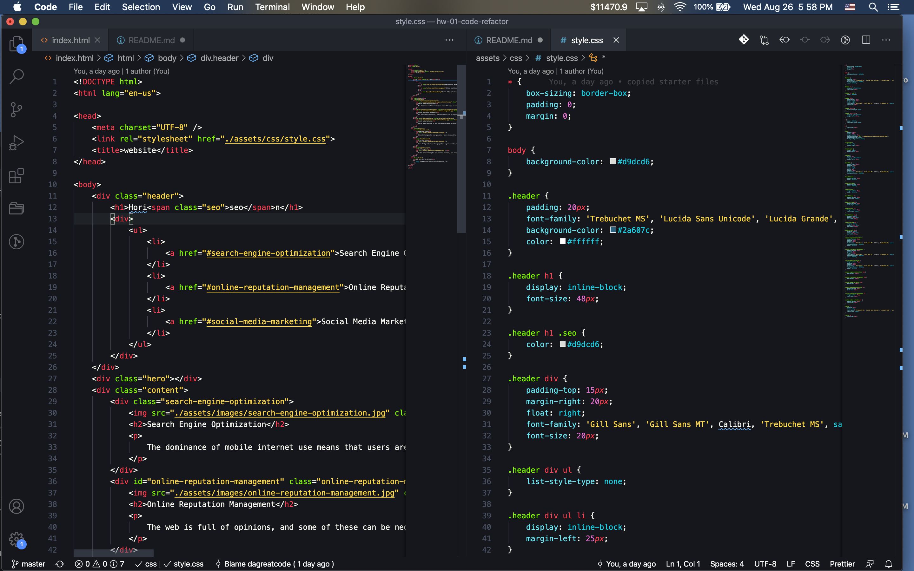
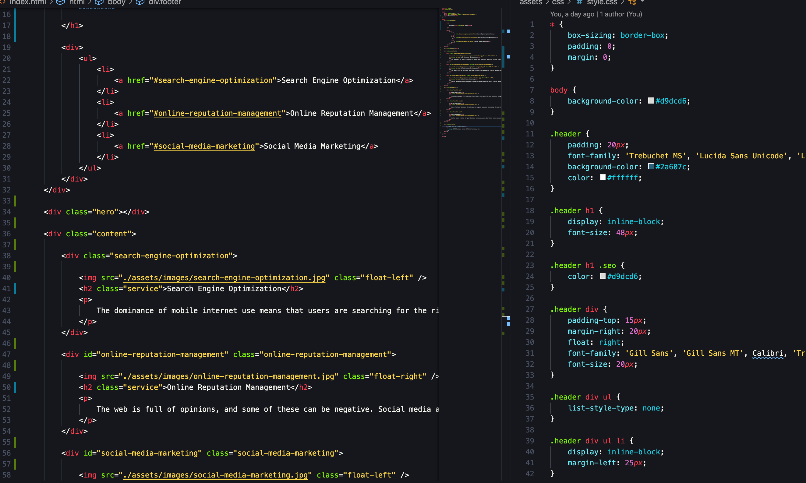

This website is ready
Make sure you view this image for better understanding.

1st thing I did was fixed the Website name in the top tab.
2nd thing I did was gave all the <h2> a class=""
3rd thing I did was added service inside the ""
4th thing i did was fix the HTML so me and others can read it at maybe first glance.
5th thing i did was took away the </image> there was no need. The ending just needed a >.

Here is the before

And Here is the after

